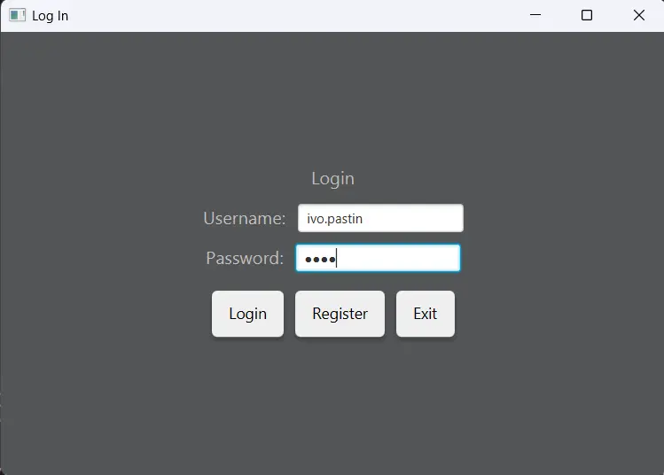
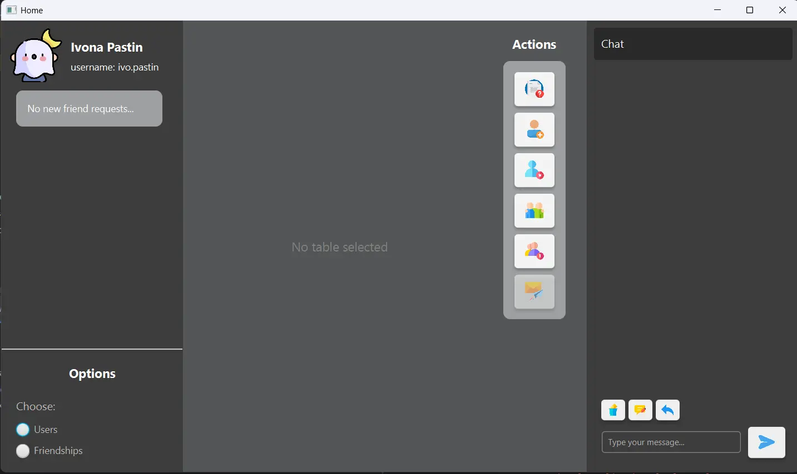

# 🌐 Social Network Application

A JavaFX-based social network application that enables users to manage friendships, handle friend requests, and communicate with each other within a network structure.

## ✨ Features

- 🔐 User authentication (login/registration)
- 👥 Friend management (send requests, accept/reject, remove friends)
- 🔔 Real-time notifications using Observer pattern
- 💬 Message exchange between users
- 💾 Database persistence (PostgreSQL)
- 🎨 Modern UI with JavaFX

## 🏗️ Architecture

The application follows a layered architecture with:

- 📦 **Domain Layer**: Contains entities like User, Friendship, FriendshipRequest, and Message
- 🗄️ **Repository Layer**: Database abstraction for CRUD operations
- ⚙️ **Service Layer**: Business logic implementation
- 🎮 **Controller Layer**: Mediates between UI and services
- 🖥️ **UI Layer**: JavaFX views

The Observer pattern is implemented for real-time notifications when:

- 🔄 Friend requests are sent/accepted/rejected
- 📨 New messages are received
- 👤 User data is updated

## 📸 Screenshots



To see the full list of users, make sure to choose the Users option from the Options menu.<br>
Check down below the demo video regarding sending messages between 2 users.

## 🎥 Demo Video
[🎬 Watch the Demo Video](videos/demo.webm)

## 📋 Requirements

- ☕ Java 11 or higher
- 🖼️ JavaFX
- 🐘 PostgreSQL database

## 🚀 Running the Application

### Using Gradle

```bash
# Run the application
./gradlew run

# Build the application
./gradlew build
```

### Using Java directly

```bash
# After building, you can run the JAR
java -jar build/libs/lab6-network-fx.jar
```

## 🗃️ Database Configuration

The application connects to a PostgreSQL database. To configure your database connection:

1. Ensure PostgreSQL is installed and running
2. Update the database credentials in `src/main/java/org/example/lab6networkfx/App.java`:

```java
String url = "jdbc:postgresql://localhost:5432/postgres";
String username = "postgres";
String password = "your_password";
```

## 📁 Project Structure

- `src/main/java/org/example/lab6networkfx/`:
  - 📊 `domain/`: Entity classes
  - 💽 `repository/`: Data access layer
  - ⚡ `service/`: Business logic
  - 🕹️ `controller/`: UI controllers
  - 🎭 `UI/`: User interface components
  - 🛠️ `utils/`: Utilities and helper classes
    - 👁️ `observer/`: Observer pattern implementation
    - 📣 `events/`: Event types and handlers
